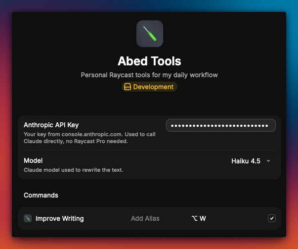

# Abed Tools

Personal Raycast tools. Currently one command.

## Improve Writing

Select text anywhere, run the command, and Claude rewrites it. The result streams into a preview where you can paste it over your selection, copy it, or keep refining it.

| Shortcut | Action                                   |
| -------- | ---------------------------------------- |
| `↵`      | Replace the selection, as rich text      |
| `⌘⇧↵`    | Replace the selection, as plain markdown |
| `⌘⇧C`    | Copy as rich text                        |
| `⌘⌥C`    | Copy as plain markdown                   |
| `⌘I`     | Refine, e.g. "shorter", "more formal"    |
| `⌘R`     | Regenerate                               |
| `⌘.`     | Stop streaming                           |

The editing rules live in `src/commands/improve-writing/prompt.ts`. Every reply is bare text, so pasting inserts the rewrite and nothing else.

## Formatting

Slack's mrkdwn is not markdown. Bold is `*text*`, there are no headings, and there is no list syntax at all. Pasting markdown into Slack leaves the asterisks on screen.

So paste and copy carry two clipboard flavors. Slack, Notion, Gmail and Docs take the HTML one and render real bold, real bullets, and real code blocks. Editors and terminals take the markdown fallback. The plain variants force markdown everywhere.

## Setup

Add your Anthropic API key from [console.anthropic.com](https://console.anthropic.com) in the extension preferences. Raycast prompts for it on first run. The model defaults to Haiku 4.5 and can be changed to Sonnet 5 or Opus 5 in the same place.



The extension calls the Anthropic API directly, so it works without a Raycast Pro subscription.

```bash
npm install
npm run dev
```
